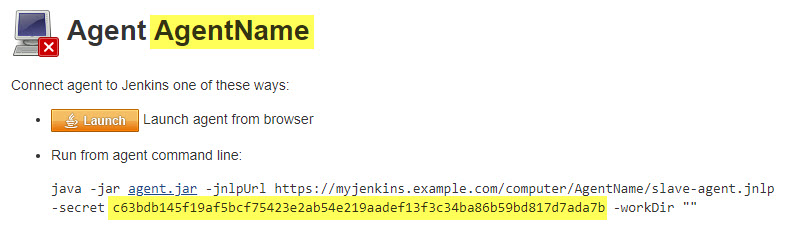

Jenkins specifics
=====

This page contains information about use-cases specific to Jenkins.

NOTE: The page is under construction


## Jenkinsfile Runner and Kubernetes plugin

The [Kubernetes plugin](https://github.com/jenkinsci/kubernetes-plugin) enables Jenkins pipelines to execute parts of the pipeline in containers on a Kubernetes cluster. To establish the connection between the container and the Jenkins master the [docker-jnlp-slave](https://github.com/jenkinsci/docker-jnlp-slave) image is used which utilizes the `remoting.jar` of this project.

Former implementations of remoting first did an HTTP(S) request to the Jenkins master to get the master´s TCP port for JNLP agents and the instance identity which are required to establish the JNLP agent connection.

When using [Jenkinsfile Runner](https://github.com/jenkinsci/jenkinsfile-runner), executing a pipeline which uses the Kubernetes plugin did not work in the past since the Jenkinsfile Runner starts its Jenkins master headless (no HTTP port). That's why we introduced a way to establish the JNLP agent connection directly, instead of retrieving the required parameters via HTTP first.

The following example command connects to a Jenkins master directly via JNLP agent protocol.   
_Prerequisite_: An agent with launch method `Java Web Start` has been created on the master and is waiting to for connection (see screenshot below).

```
java -cp remoting.jar hudson.remoting.jnlp.Main \
  -headless -noHttpEndpoint \
  -tunnel <jenkinsHost>:<jnlpAgentPort> \
  -instanceIdentity <instanceIdentityString> \
  <secretString> <agentName>
```

`-noHttpEndpoint` indicates the Jenkins master does not expose an HTTP(S) port.

`-tunnel <jenkinsHost>:<jnlpAgentPort>` specifies the Jenkins master host name and JNLP agent port.

`-instanceIdentity <instanceIdentityString>` specifies the Jenkins masters [instance identity](https://wiki.jenkins.io/display/JENKINS/Instance+Identity).   
> The correct value can be extracted from the master via (Java API or script console):   
> `hudson.remoting.Base64.encode(org.jenkinsci.main.modules.instance_identity.InstanceIdentity.get().getPublic().getEncoded())`

`-headless` runs agent in headless mode.

`<secretString>` and `<agentName>` can be found on the JNLP agents overview page on the Jenkins master.

